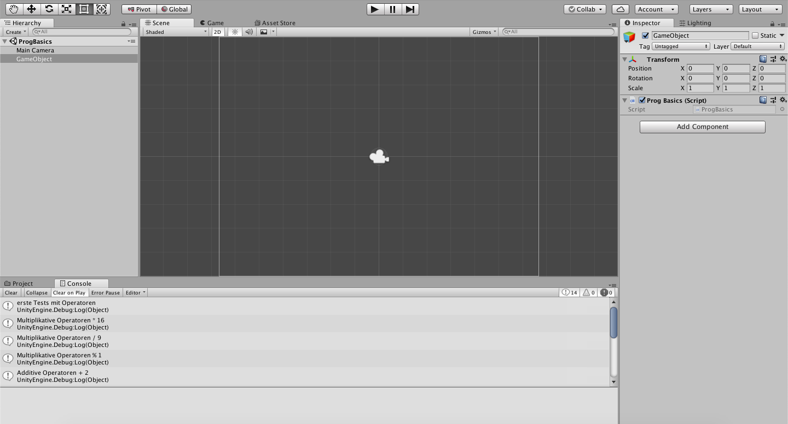

# ProgBasics-cpratter

### Development Info
Unity Version: 2018.2.14f1  
Visual Studio Code Version: 1.33.0

### Tests mit Operatoren
Mit Debug.Log in einem C# Script wurden die verschiedenen (Multiplikative, Additive, Relationale, Gleichheits und Logische) Operatoren in die Unity Console geschrieben

  

