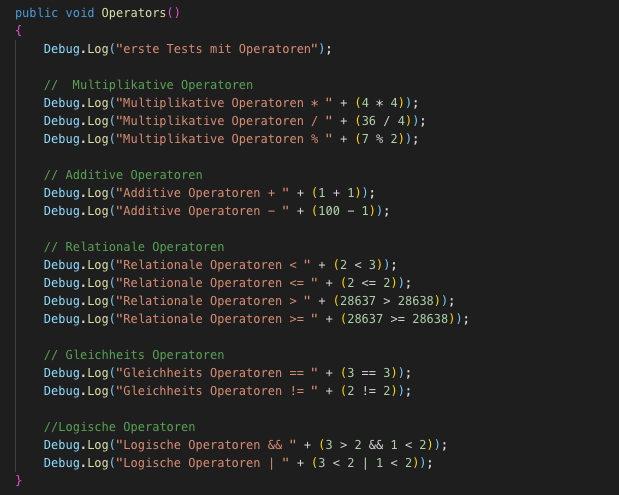
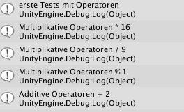

# ProgBasics-cpratter

**Progress:** 100%

### Development Platform
- OS: MacOS 10.14.3
- Unity Version: 2018.2.14f1
- Visual Studio Code Version: 1.33.0

### Description
- **Tests Operatoren:** Mit Debug.Log in einem C# Script wurden die verschiedenen (Multiplikative, Additive, Relationale, Gleichheits und Logische) Operatoren in die Unity Console geschrieben
- **Tests Methoden:** Neue Methoden wurden erstellt und sowohl normal, als auch verschachtelt ausgelesen. Beispiele mit Parametern und Return Type

### Screenshots
- Code Operators

  

- Unity Console

  

